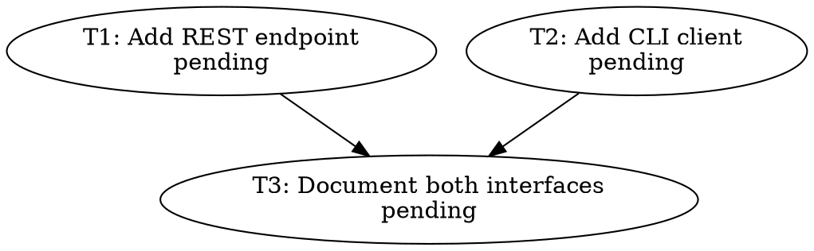

# lebang-orchestrator

`lebang-orchestrator` is a small, observable Pi package for coordinating coding
agents through visible Herdr panes, role Skills, Git worktrees, and filesystem
state.

It implements this lifecycle:

```text
PLAN -> IMPLEMENT -> SELF_VERIFY -> INDEPENDENT_TEST -> REVIEW
     -> REWORK / REPLAN -> INTEGRATE -> FINAL_VALIDATE -> COMPLETE
```

With Herdr enabled, the orchestrator starts each configured Pi agent in a named
pane, submits role-scoped work through `herdr agent prompt`, and reads the
structured result from that pane. Git commits and worktrees isolate production
tasks, while `.orchestrator/` remains the resumable source of truth. The existing
in-process SDK runner remains available when Herdr is explicitly disabled.

## Requirements

- Node.js 22.19 or newer
- Git
- Pi `0.84.1` with a configured provider
- Herdr with `agent start`, `agent prompt`, and `pane split` support

## Install

From this checkout, install dependencies and build the package:

```bash
npm install
npm run build
```

Install the standalone `orchestrator` command:

```bash
npm link
orchestrator --help
```

Install the `/orchestrator` extension and role Skills into Pi:

```bash
pi install /absolute/path/to/lebang-orchestrator
pi list
```

When running the commands from this repository, the shorter form also works:

```bash
pi install .
```

`npm link` provides the shell command, while `pi install` provides the Pi slash
command and package Skills. Install both when you want both entry points:

```text
orchestrator plan "Implement feature X"
/orchestrator plan "Implement feature X"
```

The Pi extension registers only `/orchestrator`. It does not register a
model-callable tool or a separate TUI. Command results appear as a visible
custom message without triggering a model turn.

## Before the first run

The target must be a Git repository with at least one commit. Planning uses the
current committed `HEAD` as its base. Uncommitted files in the user's current
worktree are not copied into agent worktrees, so commit or stash relevant work
before planning:

```bash
cd /path/to/target-repository
git status
git add <relevant-files>
git commit -m "Prepare orchestration base"
```

Pi must also have credentials for every configured model. Check which models
the installed Pi recognizes without making a paid model call:

```bash
pi --offline --list-models
```

The package contains a default `.orchestrator/config.json`. A target repository
can override it by creating its own `.orchestrator/config.json`; an explicit
`--config` path takes precedence over both.

## Quick start: Herdr team

Start the configured team from a Herdr-managed pane in the target repository:

```bash
orchestrator init
```

`init` creates a dedicated tab with visible named panes for `lebang`,
`westbrook`, `curry`, `duncan`, and up to `maxWorkers` coders. Every pane starts
in interactive text mode with the configured Pi model, role Skill, and tool
policy. `init` does not send a prompt to any agent. A coder selected later by
the plan is started lazily.

Send the goal to the planner, inspect the plan, and then run it:

```bash
# Ask lebang to create only the persisted task DAG.
orchestrator plan "Add request retry support with tests and documentation"

# Inspect the generated plan before any coder starts.
orchestrator graph
orchestrator status
orchestrator task T1

# Run ready tasks through coding, testing, review, and integration.
orchestrator run

# Confirm the persisted final state.
orchestrator status
```

`plan` and `run` print structured JSON. A successful final result resembles:

```json
{
  "integratedCommits": ["<commit>"],
  "issues": [],
  "status": "completed",
  "summary": "Integrated and validated the requested retry support.",
  "validations": [
    {
      "command": ["npm", "test"],
      "exitCode": 0,
      "stderr": "",
      "stdout": "..."
    }
  ]
}
```

`run` automatically calls `integrate` after all active tasks are approved. It
does not merge the result into the user's current branch; see
[Inspecting and accepting the result](#inspecting-and-accepting-the-result).

## Demo: use it inside Pi

Start Pi in the target repository after installing this package:

```bash
cd /path/to/target-repository
pi
```

Then enter:

```text
/orchestrator init
/orchestrator plan "Replace callback-based loading with async/await and preserve behavior"
/orchestrator graph
/orchestrator status
/orchestrator run
/orchestrator status
```

The slash command uses Pi's current cwd as the target repository. It invokes
the same command service and produces the same output as the standalone CLI.
The output is displayed in the transcript but does not start an extra assistant
turn.

Pi acknowledges the command immediately with a loading row that shows the
current action and elapsed time. Lifecycle commands also display a progress bar
derived from the persisted task DAG, for example:

```text
⠸ Orchestrator · Running task lifecycle · [█████░░░░░] 2/4 tasks · T3 testing · 42s
```

The loading row is removed when the command ends. A notification then reports
whether it completed, became blocked, or failed; the full JSON, status table, or
error remains in the transcript as the durable result.

## Demo: orchestrate another repository

Use `--repo` when the shell or Pi cwd is not the repository you want to change:

```bash
orchestrator --repo /work/api plan "Add pagination to the users endpoint"
orchestrator --repo /work/api status
orchestrator --repo /work/api run
```

Inside Pi, the equivalent commands are:

```text
/orchestrator --repo /work/api plan "Add pagination to the users endpoint"
/orchestrator --repo /work/api status
/orchestrator --repo /work/api run
```

To use a configuration stored outside that repository, pass it to every
command that runs agents:

```bash
orchestrator --repo /work/api --config /work/configs/api-agents.json plan "Add pagination"
orchestrator --repo /work/api --config /work/configs/api-agents.json run
```

`status`, `task`, `graph`, and `logs` only read persisted state and do not need
the configuration file.

## Demo: inspect parallel work

If the planner creates independent tasks with different owners, `run` executes
them concurrently up to `maxWorkers`. The graph makes the scheduling boundary
visible:

```bash
orchestrator plan "Add a REST endpoint and an independent CLI client"
orchestrator graph
```

An illustrative graph might look like:



Here `T1` and `T2` may run together if they have different assigned agents;
`T3` waits until both dependencies are approved. Tasks assigned to the same
owner are never run concurrently.

## Command reference

| Command | Behavior | Model call |
| --- | --- | --- |
| `init` | Starts the configured agents in visible Herdr panes without prompting them. | No |
| `plan <goal>` | Inspects the repository, creates and persists a validated DAG. Fails if a plan already exists. | Yes |
| `run` | Runs ready tasks and automatically integrates after every active task is approved. | Yes |
| `status` | Prints run state, task owners, branches, dependencies, review counts, and the latest blocker. | No |
| `task <id>` | Prints the persisted JSON for one task. | No |
| `retry <id>` | Resumes valid coder evidence or returns a stopped task to its owner, then continues the run. | Usually |
| `review <id>` | Refreshes independent test evidence and reruns review for a task currently in `reviewing`. | Yes |
| `integrate` | Integrates all approved tasks and runs final validation. Normally invoked automatically by `run`. | Yes |
| `resume` | Recovers interrupted task or integration state from persisted evidence, then continues the run. | Usually |
| `graph` | Prints the current DAG as Graphviz DOT. | No |
| `logs <id>` | Prints all preserved agent run logs for one task. | No |

All commands accept the global options before the command:

```bash
orchestrator --repo /path/to/repository --config /path/to/config.json run
```

The standalone command returns exit code `2` for command, configuration,
protocol, or filesystem errors. A completed command can still print a lifecycle
result whose JSON `status` is `blocked` or `failed`; inspect the result and
persisted task state rather than relying only on the process exit code.

## Configuration example

This is a minimal complete team. Replace the model strings with models available
in your Pi installation:

```json
{
  "agents": {
    "lebang": {
      "model": "openai-codex/gpt-5.4-mini:low",
      "role": "planner",
      "skill": "planner"
    },
    "kd": {
      "model": "openai-codex/gpt-5.4-mini:high",
      "role": "coder",
      "skill": "coder"
    },
    "westbrook": {
      "model": "openai-codex/gpt-5.4-mini:high",
      "role": "tester",
      "skill": "tester"
    },
    "curry": {
      "model": "openai-codex/gpt-5.4-mini:high",
      "role": "reviewer",
      "skill": "reviewer"
    },
    "duncan": {
      "model": "openai-codex/gpt-5.4-mini:high",
      "role": "integrator",
      "skill": "integrator"
    }
  },
  "herdr": {
    "command": "herdr",
    "enabled": true
  },
  "maxReviewAttempts": 3,
  "maxWorkers": 2,
  "validationCommands": [
    ["npm", "run", "check"],
    ["npm", "test"],
    ["npm", "run", "build"]
  ]
}
```

Configuration rules that matter in practice:

- Exactly one planner, tester, reviewer, and integrator must be configured.
- Configure at least one coder. An unassigned task prefers the coder named
  `kd`, then the first available configured coder.
- `maxWorkers` limits a deterministic ready-task batch; the same owner is still
  limited to one task at a time.
- `maxReviewAttempts` stops automatic review/rework loops at a finite boundary.
- A model can include a Pi thinking suffix such as `:high` or `:xhigh`; planners
  default to `:low` when omitted.
- SDK fallback auto-retries are disabled so failures persist immediately; use
  `retry` or `resume` for an explicit retry.
- `validationCommands` must contain at least one non-empty argument array. Each
  command runs in the isolated integration worktree without implicit shell
  parsing.
- `herdr.enabled=true` makes visible pane agents the execution path and requires
  the command to run inside Herdr. Set it to `false` only for the in-process SDK
  fallback; `init` is unavailable in that mode.

Configure agent identities, roles, role Skills, models, concurrency, review
limits, Herdr, and final validation commands in `.orchestrator/config.json`.
Models belong only in configuration; Skills never select models. The legacy
`piCommand` field is still accepted when reading Python-era configuration, but
it is ignored because Herdr starts the supported `pi` agent kind directly.

## Inspecting and accepting the result

Integration always happens on an isolated branch named:

```text
orchestrator/<run-id>/integration
```

Find the exact branch and worktree in `.orchestrator/state.json`:

```bash
node -e 'const s=require("./.orchestrator/state.json"); console.log(s.integrationBranch)'
node -e 'const s=require("./.orchestrator/state.json"); console.log(s.integrationWorktree)'
```

Review the result before changing the user's branch:

```bash
git branch --list 'orchestrator/*/integration'
git log --oneline HEAD..orchestrator/<run-id>/integration
git diff HEAD...orchestrator/<run-id>/integration
```

If the current branch has not advanced since planning, it can normally be
fast-forwarded after review:

```bash
git merge --ff-only orchestrator/<run-id>/integration
```

If `--ff-only` fails, the user's branch has diverged. Resolve that as a normal
Git integration decision; the orchestrator intentionally does not rewrite,
reset, or merge the user's current branch.

## Recovery and troubleshooting demos

Start with read-only inspection:

```bash
orchestrator status
orchestrator task T2
orchestrator logs T2
```

After the process or machine was interrupted, use persisted evidence to recover
the whole run:

```bash
orchestrator resume
```

Retry one stopped task only when its status is `failed`, `blocked`, or
`interrupted` and its dependencies are satisfied:

```bash
orchestrator retry T2
```

`retry` preserves the original owner. If a valid committed coder result already
exists, it resumes at independent testing instead of rerunning the coder. A task
that exhausted `maxReviewAttempts` must be replanned or deliberately reassigned;
`retry` will not bypass that boundary.

Use `review` only for a task left in `reviewing`:

```bash
orchestrator review T2
```

Use manual integration only when every active task is already `approved`,
`completed`, or recovering from `integrating`:

```bash
orchestrator integrate
```

Common errors and their meaning:

- `an orchestration plan already exists`: this repository already has an active
  or archived-on-disk run. Inspect `.orchestrator/state.json` before starting a
  new goal.
- `task ... is already locked`: another orchestrator process owns that task.
  Dead-process locks are removed automatically; do not delete a live lock.
- `coder changedFiles does not match`: the structured result disagrees with the
  actual committed diff.
- `tester modified production paths`: tester commits may contain only tests,
  fixtures, mocks, or other recognized test-support files.
- `integration requires every task to be approved`: inspect `status`; more task
  work or recovery is required before integration.
- `no logs found`: no agent run has been persisted for that task yet, or the task
  id is incorrect.

Only one persisted plan is active per target repository. Before starting an
unrelated new goal, archive the existing `.orchestrator` data and deliberately
clean up its registered Git worktrees and branches. Do not remove those paths
while an orchestrator process is running.

## Custom role Skills

The packaged Skills are used by default. Override a role for one target
repository by adding:

```text
.skills/
  coder/
    SKILL.md
```

For example, a repository-specific coder Skill can require its own lint command
or contribution conventions. The override changes role instructions only; the
model and tool allowlist still come from orchestrator configuration and role
policy.

## Execution model

`plan` asks `lebang` for a TypeBox-validated task DAG. `run` schedules a
deterministic batch of ready tasks up to `maxWorkers`, never running two tasks
with the same owner concurrently. Every production task gets:

```text
branch:   agent/<identity>/<task>
worktree: .worktrees/<task>-<identity>
```

The original coder owns task-local rework. Test-only review findings return to
`westbrook`; plan-scoped findings return to `lebang`. After every active task is
approved, `duncan` integrates task commits on an isolated
`orchestrator/<run>/integration` branch. The user's current branch is not
modified.

Each visible pane starts in Pi's interactive text mode and uses the configured
model/thinking suffix, a strict role tool allowlist, and only the current role
Skill. Extension discovery is disabled in child sessions to prevent recursive
loading. `plan` sends the plan prompt to the configured planner pane; later role
prompts carry the task worktree explicitly, and Herdr keeps the agent
conversation visible while the orchestrator persists the structured handoff.

## Persistence and recovery

Runtime data stays plain and inspectable:

```text
.orchestrator/
  config.json
  plan.json
  state.json
  tasks/<task>.json
  runs/<task>/<role>/<run>.json
  runs/<task>/<role>/sessions/*.jsonl
  logs/<task>-<agent>-<run>.log
  history/<task>.jsonl
  locks/<task>.lock
.worktrees/
  <task>-<coder>/
  <run>-<integrator>/
```

Every agent run records identity, role, model, cwd, timestamps, exit code,
Herdr transcript or SDK events, stderr, and the parsed structured result. JSON
state writes are atomic, history appends are fsynced, and task locks remove
stale PIDs before recovery.

The camelCase state format is compatible with the previous Python release.
`orchestrator resume` and `orchestrator retry` can continue existing
`.orchestrator` data when persisted evidence still matches a clean Git commit.
A worktree's existence alone never proves completion.

Role Skills are packaged under `skills/`. A target repository can override one
by providing `.skills/<role>/SKILL.md`.

## Development

```bash
npm run check
npm test
npm run build
npm pack --dry-run
```

Tests use temporary Git repositories, fake Herdr command responses, and fake SDK
sessions. They do not require credentials, API calls, or paid tokens. The package intentionally excludes
databases, distributed queues, remote worker fleets, dashboards, custom model
provider layers, extra TUIs, and unbounded automatic retries.

`dist/` is intentionally committed. Pi installs Git packages with development
dependencies omitted, so installation consumes the prebuilt files and never
needs a local `tsc`; `npm pack` rebuilds them through the `prepack` script.
